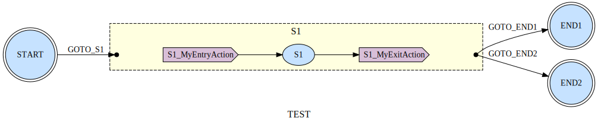

# statemachine-uml-plugin

**What's the point of state machine if you can't visualize them?**<br>
This plugin adds the `GenerateUml` Gradle task.
when run - it generates `DOT` and `svg` files for each of your state machines
<br><br>

---

### Prerequisites
**Install** [Graphviz](https://formulae.brew.sh/formula/graphviz)

This also installs the `DOT` cli tool. the plugin leverages them to create output diagrams in `dot` and `svg` formats

    brew install graphviz

**Make sure the state machine you're visualizing has an empty constructor** `StateMachineDefiner`.

---

### Usage
Apply the latest plugin version
  ```
    plugins {
        id("io.github.yonigev.sfsm-statemachine-uml-generator") version "<version>"
    }
  ```

  
Add the annotation to every `StateMachineDefiner` you want to visualize

   ```
    @Uml
    class LoginStateMachineDefiner : StateMachineDefiner<LoginState, LoginTrigger>() {
       ...
    }
   ```

Sync your Gradle project<br>
Under your project's root directory, run:

```agsl
./gradlew GenerateUml
```
This task will create a `generated-uml` directory in your project, containing the generated `SVG` and `DOT` files

      